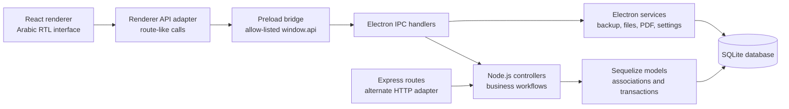
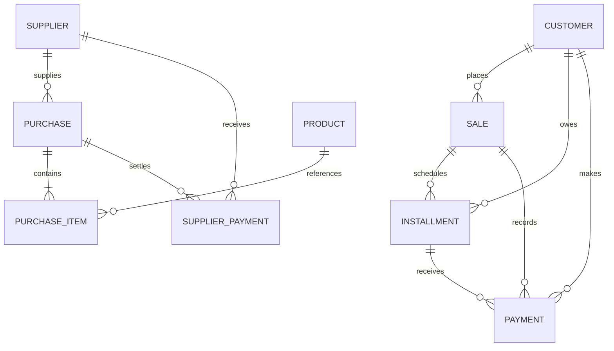

<p align="center">
  
</p>

<h1 align="center">Electrical Tools Management System</h1>

<p align="center">
  <strong>An Arabic, offline-first Windows desktop application that brings a shop's inventory, sales, installment collections, customer and supplier accounts, purchasing, and cash movement into one local system.</strong>
</p>

<p align="center">
  <a href="https://www.electronjs.org/"></a>
  <a href="https://react.dev/"></a>
  <a href="https://vite.dev/"></a>
  <a href="https://www.sqlite.org/"></a>
  
  <a href="./package.json"></a>
</p>

<p align="center">
  <a href="#overview">Overview</a> ·
  <a href="#features-by-module">Features</a> ·
  <a href="#architecture">Architecture</a> ·
  <a href="#getting-started">Getting Started</a> ·
  <a href="#testing-and-validation">Testing</a> ·
  <a href="#roadmap">Roadmap</a>
</p>

---

## Overview

Electrical Tools Management System is a locally persisted desktop operations application for an electronics or electrical-tools shop. It provides an Arabic right-to-left interface for day-to-day commercial work without requiring a hosted database or cloud backend.

The primary runtime is Electron. A React renderer communicates through an allow-listed preload API to Electron IPC handlers, which reuse the same Node.js controller layer exposed by the repository's Express routes. Sequelize maps the domain to a local SQLite database.

This project was independently designed, developed, and maintained by **Ahmed Abdelmonem**.

## Business Problem

Small retail operations often split stock counts, installment schedules, customer debts, supplier balances, and cash movements across paper records or unrelated spreadsheets. That makes it difficult to answer basic operational questions reliably:

- What is physically available to sell?
- Which customers have pending or overdue installments?
- What is owed to each supplier?
- Which transaction changed the treasury balance?
- Can a sale, collection, or purchase be reversed without leaving stock and cash out of sync?

This application centralizes those workflows in one offline desktop system and applies their financial and inventory effects through the same transactional data layer.

## Main Workflows

1. **Prepare master data** — create products, customers, and suppliers; maintain stock, pricing, contact details, notes, and optional customer national-ID data.
2. **Record a sale** — select a customer and products, set quantities and per-sale prices, choose cash or installments, and optionally set a down payment, interest rate, term, and sale date.
3. **Collect installments** — review schedules grouped by customer and invoice, record full or partial collections with a collection date, or reverse the latest active installment payment.
4. **Record purchases** — create a supplier purchase, add item quantities and costs, record the amount paid, increase stock, and carry the unpaid balance to the supplier account.
5. **Review financial position** — inspect dashboard totals, treasury inflows and outflows, customer statements, supplier statements, invoice history, and overdue balances.
6. **Protect continuity** — create and restore manual database backups, configure a backup folder and retention count, and allow the application to create a due monthly backup at startup.

## Features by Module

### Dashboard

- Total customers, sales value, treasury balance, collections, and overdue-installment indicators.
- Recent activity feed covering sales, incoming payments, and newly created customers.
- A quick installment calculator for price, down payment, interest, term, and estimated monthly amount.

### Products and Inventory

- Product creation, editing, listing, pricing, categories, and stock quantities.
- Stock deduction during sales and stock restoration when an active sale is cancelled.
- Stock increases from supplier purchases and is adjusted when purchases are edited or deleted.
- Deletion guards for products referenced by historical sales or purchase items.

### Customers

- Customer creation, editing, deletion, pagination, and debounced search.
- Optional phone, national ID, notes, address/email fields at the model level, opening balance, and national-ID image data.
- Phone and national-ID validation in both the renderer and controller layer.
- Calculated balances, customer profiles, transaction history, installment schedule, and running account statements.
- Deletion guards when sales, installments, or payments already reference a customer.

### Sales

- Cash and installment sales with a selectable business date.
- Product search, quantity controls, per-sale price overrides, stock validation, and invoice identifiers.
- Integer-based currency storage and basis-point interest calculations.
- Down payments, exact installment distribution, due-date generation, and partial-payment support.
- Sales history filtering by date period, customer, or invoice.
- Transactional sale cancellation that restores stock, reverses received cash, removes its installment schedule, and retains the cancelled sale record.

### Installments

- Customer- and invoice-grouped schedules with pending, partial, paid, and overdue states.
- Full or partial collection against the remaining installment amount.
- Collection-date capture and treasury/payment-ledger updates.
- Reversal of the latest active installment payment with a cancellation reason.
- Filtered Microsoft Excel export through SheetJS.

### Suppliers and Purchasing

- Supplier creation, editing, search, balance calculation, and guarded deletion.
- Purchase invoices with multiple product lines, quantities, cost prices, paid amounts, and remaining balances.
- Supplier payments recorded independently or alongside a purchase.
- Supplier account statements with purchases, payments, running balance, and PDF export.

### Treasury

- Consolidated incoming and outgoing payment ledger.
- Sources for sales, installments, purchases, supplier payments, expenses, manual deposits, refunds, and sale cancellation entries.
- Filters for period, direction, source, cancelled entries, reference number, and description.
- Manual expense and deposit entries.
- Reconciliation of the cached main-vault balance against the payment ledger.

### Reports, Export, and Recovery

- Customer and supplier account statements exported to A4 PDF using Electron's `webContents.printToPDF()`.
- Installment schedules exported to `.xlsx` files.
- Manual SQLite backup and restore with file dialogs and application restart after restore.
- Configurable automatic backups, a 30-day due check, and retention-based rotation of older backup files.

### Desktop Experience

- Arabic right-to-left interface.
- Dark and light themes persisted in local browser storage.
- Lazy-loaded routes, toast feedback, defensive data normalization, and renderer error boundaries.
- Single-instance desktop behavior, splash screen, maximized main window, and Windows shortcut lifecycle handling.

## Technology Stack

Versions below are the direct versions resolved by the current lockfiles.

| Layer | Technology | Version / role |
| --- | --- | --- |
| Desktop runtime | Electron | `33.4.11` |
| Frontend | React / React DOM | `19.2.4` |
| Routing | React Router DOM | `7.13.2` with hash routing |
| UI support | Lucide React / React Hot Toast | `1.7.0` / `2.6.0` |
| Renderer build | Vite / React plugin | `8.0.3` / `6.0.1` |
| Backend runtime | Node.js / CommonJS | Controller and service layer |
| HTTP adapter | Express / CORS | `5.2.1` / `2.8.6` |
| ORM | Sequelize | `6.37.8` |
| Database driver | SQLite3 | `5.1.7` |
| Desktop settings | Electron Store | `8.1.0` |
| Spreadsheet export | SheetJS `xlsx` | `0.18.5` |
| Packaging | Electron Forge / Squirrel maker | `7.11.1` / `7.11.1` |
| Linting | ESLint | `9.39.4` |

The implemented renderer uses its own IPC-backed API adapter, PDF generation uses Electron, and the configured production packager is Electron Forge.

## Architecture



The controller layer is adapter-neutral: Express passes real request/response objects, while the Electron IPC adapter constructs compatible request/response shapes and serializes controller results for the renderer. In the packaged desktop application, the renderer uses IPC rather than HTTP.

## Electron Architecture

- `main.js` enforces a single application instance, registers IPC handlers, initializes SQLite, manages the splash/main windows, and starts the automatic-backup check.
- During desktop development, the main process starts Vite and loads `http://localhost:5173` after it becomes available.
- In a packaged build, Electron loads `client/dist/index.html` from the application bundle and closes renderer developer tools.
- `preload.js` is the only renderer-to-main bridge. It exposes named customer, product, sale, installment, payment, supplier, purchase, statistics, system, and PDF operations.
- Data operations reuse controllers through `ipcMain.handle()`. Separate handlers own backups/restores, local file processing, application settings, and PDF generation.
- Electron Forge packages the application into an ASAR archive and creates a Windows Squirrel installer under `out/`.

## Database Architecture



The schema contains ten Sequelize models: `Customer`, `Product`, `Sale`, `Installment`, `Payment`, `SystemVault`, `Supplier`, `Purchase`, `PurchaseItem`, and `SupplierPayment`.

- Development stores `database.db` at the application root.
- Packaged builds store the active database in Electron's operating-system `userData` directory, typically `%APPDATA%\system_app\database.db` on Windows.
- Sales retain their product lines as JSON snapshots. Purchase lines use the normalized `PurchaseItem` table.
- Monetary columns are stored as integer cents/piastres. Interest rates are stored as basis points.
- Startup authenticates the database, runs the repository's idempotent runtime migration checks, synchronizes missing model structures without `alter` or `force`, and runs SQLite `VACUUM`.
- Foreign keys use `RESTRICT` on deletion and `CASCADE` on key updates; controller-level deletion checks provide additional business protection.

## Security

The implemented security boundary is local desktop isolation rather than a remote identity system.

- Electron renderer `nodeIntegration` is disabled.
- `contextIsolation` is enabled.
- The preload script exposes a fixed operation list instead of raw Node.js or unrestricted IPC access.
- The main window removes the application menu and the runtime uses a single-instance lock.
- Environment files, databases, backups, logs, build output, and editor state are excluded by `.gitignore`.
- Electron Forge explicitly excludes local environment files, database snapshots, backups, editor state, diagnostic utilities, installer output, logs, and temporary files from `app.asar`.
- Destructive system reset requires a confirmation code and a two-step UI warning.

> [!IMPORTANT]
> User authentication, authorization, roles, and encrypted database storage are **not implemented**. The reset code is a destructive-action confirmation guard, not a login mechanism. The Express adapter also enables CORS and has no authentication middleware, so it should only be used on a trusted local machine and must not be exposed directly to an untrusted network.

## Data Integrity

- Sales, purchases, installment collections, installment-payment reversals, and supplier payments use Sequelize transactions.
- Currency conversion and installment distribution use integer arithmetic; interest calculation uses basis points and `BigInt` rounding.
- Sale cancellation applies compensating inventory and treasury records while preserving the sale as cancelled.
- Installment-payment cancellation soft-deletes the payment entry and reverses its installment and treasury effects.
- Supplier balances are derived from purchases and supplier payments, with short-lived caching and persisted reconciliation data.
- Treasury totals are recalculated from non-deleted payment entries and reconcile the `SystemVault` cache when needed.
- Manual backup/restore and automatic backup rotation provide local recovery paths.

## Getting Started

### Prerequisites

- Windows for the configured Squirrel installer target.
- Node.js `^20.19.0` or `>=22.12.0`, as required by the resolved Vite version.
- npm. Validation for this repository was performed with Node.js `24.18.0` and npm `11.16.0`.

### Installation

```bash
git clone https://github.com/Ahmed15109/electrical-tools-system.git
cd electrical-tools-system
npm ci
npm ci --prefix client
```

The core Electron application does not require a cloud database. Two environment variables are optional:

```dotenv
PORT=5000
RESET_SECRET=replace-with-a-local-confirmation-code
```

`PORT` applies to the standalone Express adapter. `RESET_SECRET` overrides the built-in reset-confirmation value. Keep `.env` local; it is ignored by Git.

### Development

Run the functional desktop development environment:

```bash
npm run app:dev
```

Electron initializes the local database, starts Vite, waits for the renderer, and opens the desktop window.

The repository also exposes the adapters separately:

```bash
npm run server   # Express API adapter with Nodemon
npm run client   # Vite renderer only
npm run dev      # both processes concurrently
```

The current renderer is wired to Electron's `window.api` preload bridge, so `npm run app:dev` is the supported full-application workflow. A browser-only Vite session does not provide that bridge.

### Production Build

Build only the React renderer:

```bash
npm run build
```

Create the Windows desktop package and Squirrel installer:

```bash
npm run app:build
```

Electron Forge writes packaged output and installer artifacts below `out/`. These generated files are excluded from version control.

## Folder Structure

```text
.
├── client/                     # React renderer and Vite configuration
│   ├── public/                 # Renderer icons and favicon
│   └── src/
│       ├── components/         # Forms, tables, boundaries, and reusable UI
│       ├── hooks/              # Search, autocomplete, and theme hooks
│       ├── pages/              # Business screens and workflows
│       ├── services/api.js     # Route-like renderer-to-IPC adapter
│       └── utils/normalize.js  # Input, currency, and date helpers
├── src/
│   ├── config/                 # Database path, startup, migrations, settings store
│   ├── controllers/            # Business operations shared by HTTP and IPC
│   ├── ipc/                    # Data, backup, file, and PDF handlers
│   ├── mappers/                # Serializable entity normalization
│   ├── middleware/             # Express digit-normalization middleware
│   ├── models/                 # Sequelize models and associations
│   ├── routes/                 # Express route adapter
│   ├── services/               # Automatic backup service
│   └── utils/                  # Integer currency utilities
├── main.js                     # Electron main process
├── preload.js                  # Context-isolated renderer bridge
├── server.js                   # Standalone Express adapter
├── squirrel_startup.js         # Windows Squirrel lifecycle handling
├── splash.html                 # Desktop splash window
└── package.json                # npm scripts and Electron Forge configuration
```

## Testing and Validation

The renderer has an ESLint command and both production build paths can be exercised locally:

```bash
npm run lint --prefix client
npm run build
npm run app:build
```

There is currently no automated unit, integration, or end-to-end test suite. The root `npm test` script is a placeholder that exits with an error. Until tests are added, releases should be smoke-tested through the Electron workflow, including database startup, a representative sale/purchase flow, PDF generation, Excel export, backup, and restore against disposable data.

## Roadmap

- Add controller-level unit tests, SQLite integration tests, Electron end-to-end tests, and CI validation.
- Replace runtime schema checks with a versioned migration ledger and repeatable migration tests.
- Normalize sale line items into a relational table while retaining immutable invoice snapshots.
- Add optional user authentication, role-based permissions, audit history, and encrypted-at-rest data for multi-user or shared-device deployment.
- Add code signing, release automation, and a defined application-update distribution channel.
- Verify packaged `app.asar` contents in CI to prevent regressions in publication and installer exclusions.
- Bundle fonts locally and strengthen accessibility and keyboard-navigation coverage.
- Continue periodic dependency, installer-content, and repository-data audits before public releases.

## My Contributions

Ahmed Abdelmonem independently designed, developed, and maintains this project. The implemented responsibilities represented in the repository include:

- Overall desktop application architecture and module boundaries.
- Electron main-process lifecycle, preload bridge, IPC integration, packaging, and Windows installer configuration.
- React frontend architecture, Arabic RTL interface, routing, theming, forms, tables, filters, and workflow feedback.
- Node.js controller layer and the alternate Express route adapter.
- SQLite schema design, Sequelize models and associations, runtime migrations, database path handling, and financial precision refactoring.
- Business logic for products and inventory, sales, installment schedules and collections, customers, suppliers, purchases, treasury movements, cancellation/reversal behavior, and account statements.
- PDF statements, Excel export, manual backup/restore, automatic backup rotation, and system reset safeguards.
- Electron boundary hardening through context isolation, disabled renderer Node integration, and an allow-listed preload API.
- npm/Vite/Electron Forge build configuration and project documentation.

No authentication subsystem is present in the current codebase, so authentication is not claimed as an implemented contribution.

## License

`package.json` declares the project license as **ISC**. A standalone root `LICENSE` file is not currently included; add the complete license text before presenting the repository as formally licensed for reuse.

## Contact

**Ahmed Abdelmonem**<br />
GitHub: [@Ahmed15109](https://github.com/Ahmed15109)

---

<p align="center">
  Built independently as an offline desktop system for practical retail operations.
</p>
